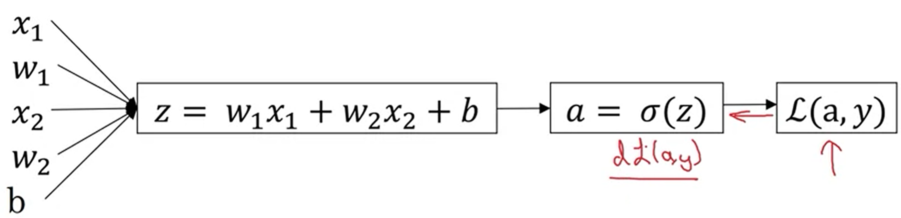

### Logistic Regression 

- The Equation is given by ```y = wx+b```
    - ```w``` is the weight, $\in R^n$
    - b $\in R$
- The weights are updated, and since output y can be large, apply an activation function (sigmoid) to the output `y` get the output in required range `[0, 1]`

- Train the weight parameters `w` and `b`

- $y = \sigma(w^Tx+b)$

- Sigmoid Function $ \sigma (z) = \frac{1}{1+e^{-z}}$

Loss Function

<!-- -  One way $L(y`, y) =0.5(y`-y^2)$ -->
    
- $L(\hat y, y) = -[ylog\hat y + (1-y)log(1-\hat y)]$


Cost Function

- How well your model is performing

- The cost function is given by for given weights `(w, b)`

    - $J(w, b) = \frac{1}{m} \sum_{i=1}^{m} L(\hat y^i, y^{i})$

</br>
</br>

The GOAL is your model should learn the parameters `(w, b)` that minimize the cost function `L`


### Gradient Descent

The cost function of Logistic Regression is a convex function which is like a `bowl`

The weights are updated as follows
- $w:= w- \alpha \frac{\partial J(w)}{\partial w} $ 
- $b: = b- \alpha \frac{\partial b}{\partial w}$

No matter where you start in the cost function you subtract and eventually end up at the minima


If there is `b` the graph would be 3D


### Computation Graph

For a given equation, you can draw a computational graph and the `Forward pass` (left to right) would be the value of the final variable or node, the `backward pass` (right to left) would be the derivative of the output variable w.r.t the input variable

### Computation Graph of the Cost function


Once you have the derivatives you can have the updates for the weights
